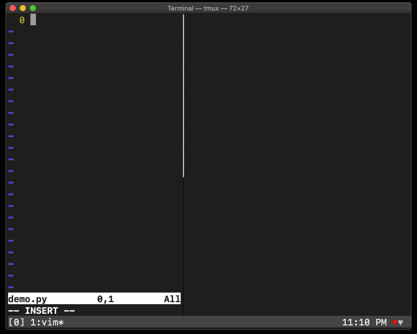

# Live-preview speedcoding tool for Python (prototype)

Yep, someone created this already:
https://github.com/donkirkby/live-py-plugin

Vim support?
https://github.com/donkirkby/live-py-plugin/issues/287

Something similar in Vim
https://github.com/metakirby5/codi.vim
